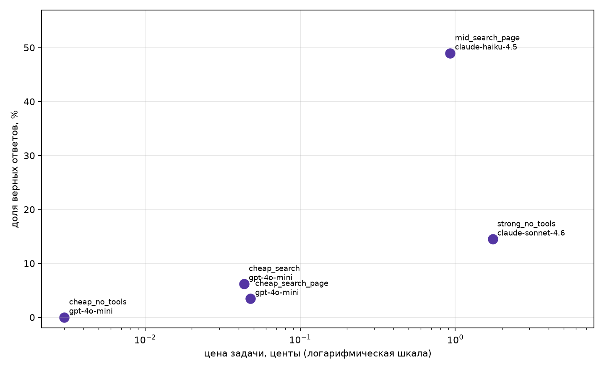

# Домашнее задание 1

## Датасет

`data/fresh.jsonl` содержит 145 вопросов: 125 стартовых и 20 моих вопросов по вышедшим сериям четвёртого сезона Re:Zero. Вопросы составлены по описаниям эпизодов со страницы [Re:Zero season 4](https://en.wikipedia.org/wiki/Re:Zero_season_4). Ответ каждого вопроса дословно есть в поле `evidence`.

```text
записей: 145, проблем: 0
Sonnet 4.6 без инструментов: 21 из 145 верно, 14.5%
Критерий свежести <= 20%: пройден
```

Полный вывод находится в [results/freshness.txt](results/freshness.txt).

## Запуск

```bash
python -m venv .venv
source .venv/bin/activate
pip install -r requirements.txt
cp .env.example .env
python -m pytest -q
python check_fresh.py data/fresh.jsonl
python homework_agent.py --data data/fresh.jsonl --workers 4
```

В `.env` нужно указать `OPENROUTER_API_KEY`.

Агент использует `web_search`, `page_find`, `calculator` и `python_exec`. В цикле есть ограничение шагов, защита от повторов, мягкое завершение, учёт стоимости и JSON-трейсы.

## Результаты

| Конфигурация | Модель | Верно | Цена задачи, $ | Цена верного, $ | Шаги | Секунды |
|---|---|---:|---:|---:|---:|---:|
| strong_no_tools | claude-sonnet-4.6 | 14.5% | 0.017417 | 0.120258 | 1.00 | 19.06 |
| cheap_no_tools | gpt-4o-mini | 0.0% | 0.000030 | ∞ | 1.00 | 2.14 |
| cheap_search | gpt-4o-mini | 6.2% | 0.000435 | 0.007001 | 5.47 | 10.70 |
| cheap_search_page | gpt-4o-mini | 3.4% | 0.000478 | 0.013857 | 5.32 | 12.92 |
| mid_search_page | claude-haiku-4.5 | 49.0% | 0.009281 | 0.018954 | 3.60 | 22.54 |



## Провалы

- [fresh-13](traces/cheap_search_page/gpt-4o-mini/fresh-13.json): статья была найдена, но `page_find` не вернул точное значение 41.5 °C. Модель ответила только «Over 40 °C».
- [fresh-132](traces/cheap_search_page/gpt-4o-mini/fresh-132.json): Wikipedia отвечала HTTP 429, агент продолжил повторять поиск и угадал неправильную форму названия.

## Вывод

Дешёвая модель с инструментами была дешевле Sonnet, но уступила ей по качеству. Средняя модель с поиском и чтением страницы получила 49.0% против 14.5% у Sonnet и стоила дешевле на задачу. Инструменты помогли, но результат сильно зависит от модели и стабильности поиска.
